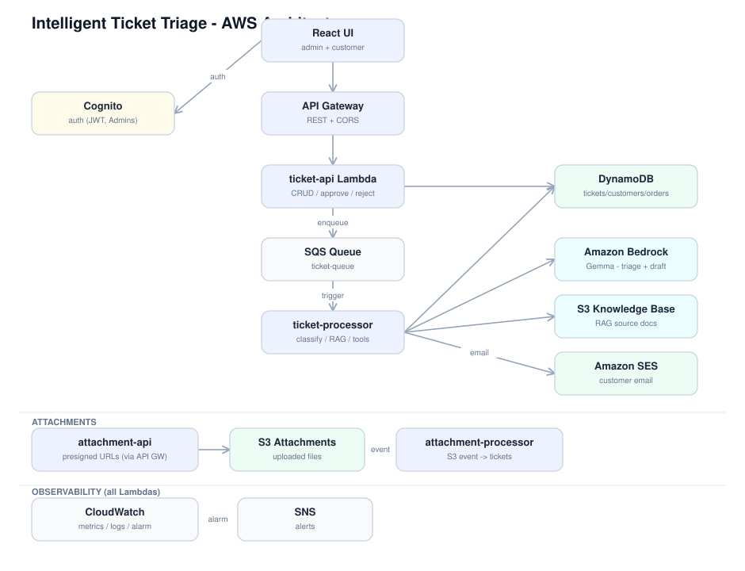
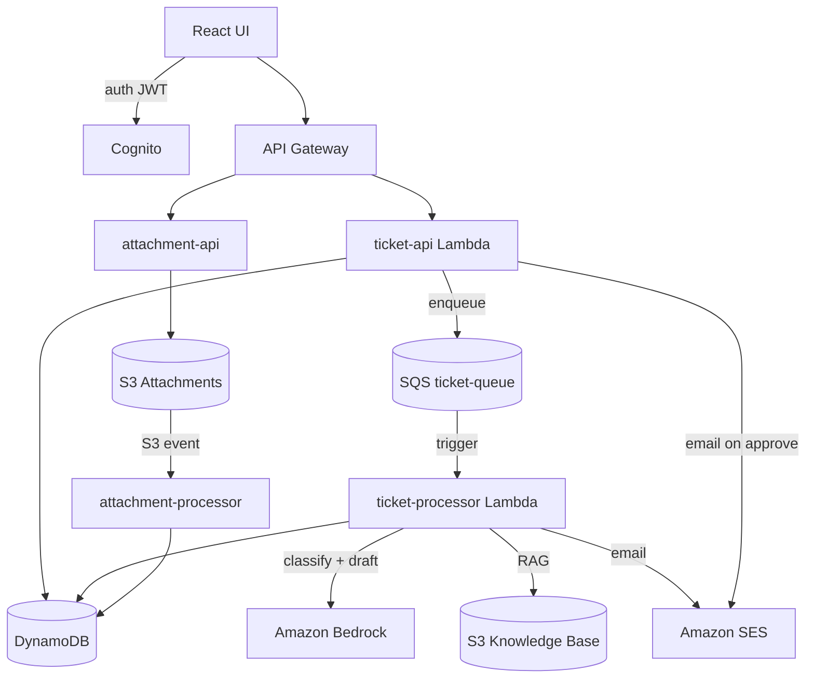
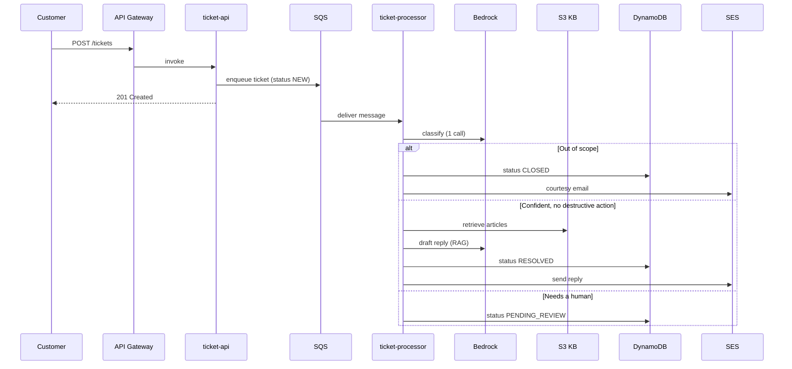
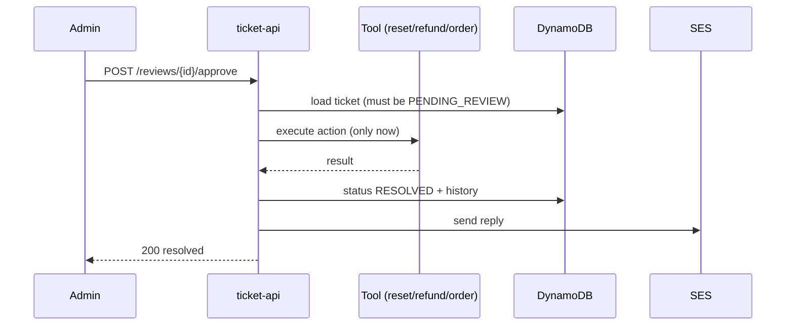

# Architecture

## Components

| Component | Responsibility |
|---|---|
| **React UI** | Admin console (triage, review, analytics) and customer portal, authenticated via Cognito. |
| **Amazon Cognito** | Authentication and authorization; the `Admins` group gates the admin surface. |
| **API Gateway** | REST entry point with CORS; routes to the Lambda functions. |
| **ticket-api Lambda** | Ticket CRUD, analytics, and the review actions (approve/reject). Enqueues new tickets to SQS. |
| **SQS (ticket-queue)** | Decouples ingestion from AI processing so the API responds instantly and processing scales independently. |
| **ticket-processor Lambda** | SQS consumer. Runs the single classification call, RAG drafting, tool execution, the review gate, and persists the result. |
| **Amazon Bedrock** | The AI layer (`google.gemma-3-27b-it`) — one call returns category, priority, sentiment, language, confidence, and action. A second call drafts the reply. |
| **S3 Knowledge Base** | Help-center articles by category, retrieved for grounded (RAG) replies. |
| **DynamoDB** | `tickets` (with a `status` GSI), `customers` (with an `email` GSI), and `orders`. |
| **Amazon SES** | Sends the customer email on auto-resolve, out-of-scope, and approval. |
| **attachment-api / attachment-processor** | Presigned S3 upload/download URLs; an S3 event attaches the uploaded file to the ticket. |
| **CloudWatch + SNS** | Custom metrics, structured logs, and an error alarm that notifies via SNS. |

## Flow (editable — renders on GitHub)

## Sequence — ticket in → reply out

## Sequence — review + tool call (human-in-the-loop)

See [`decisions/`](decisions/) for the design trade-offs behind these choices.
